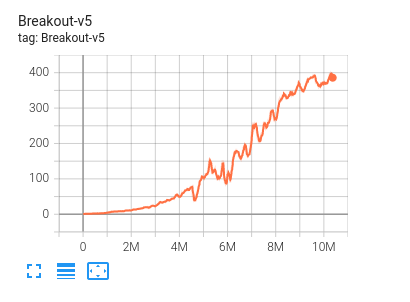
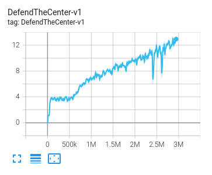

# jax-experiments

Implementation in Jax of Impala based algorithms

## dependancies
vizdoom : https://github.com/mwydmuch/ViZDoom  

vizdoomgym : https://github.com/shakenes/vizdoomgym  

gym :  

    pip install pyglet
    pip install gym
    pip install Box2D
    pip install gym[atari,accept-rom-license]

jax :  

    pip install jax
    pip install dm-haiku
    pip install optax

ray :  

    pip install ray

opencv :  

    pip install opencv-python

tesorboard :  

    pip install tensorboardX

envpool :  

    pip install envpool

## QRDQN.py : 
Quantil regression algorithm (see https://arxiv.org/abs/1710.10044 for more details) with prioritized experience replay with sum and min tree (https://arxiv.org/abs/1511.05952).

## V_TRACE.py : 

V-trace (https://arxiv.org/abs/1802.01561) algorithm with the possibility to using Expected-Emphatic n-steps TD learning (https://arxiv.org/abs/2107.05405 but now this doesn't work), thrust-region sheme (https://arxiv.org/abs/1909.11583), auto-tuned KL-divergence contraints (https://arxiv.org/abs/1909.12238) and auto-tuned Entropy hyperparameter

## sync_env.py and async_env.py :
python (then slow) implementation of vectorized environnents with Pipe and Process, these algorithms are applied in `slow_sync_lerning.py` with V_TRACE and `slow_sync_learningDQN.py` with QRDQN (6000 FPS on my laptop : Ryzen 7 16 cores and an NVIDIA RTX 2080)

## test_ray.py :
basic implementation of V_TRACE (several workers on the CPU and a centralized worker on the GPU) with ray

## run_async.py and run_sync.py : 
Fast paralellelism for deep-reinforcement learning with V_TRACE and envpool (https://github.com/sail-sg/envpool), 24000 FPS for ETD and 28000 FPS for V_TRACE (up to 32000 on an NVIDIA V100 with 60 cores)

run_async solve Breakout and Doom (DefendTheCenter, DeadlyCorridor and Basic environnements) in 30 minutes (10M and 3M learner frames $\Leftrightarrow$ 40M and 12M environnement frames) :  

## Anakin_Pong.py : 

My own implementation of Anakin (https://arxiv.org/abs/2104.06272) with pong ($\sim$ 12000 FPS in terme of learner steps with the Nature DQN architecture), learn pong with an MLP model in 60-120 seconds

